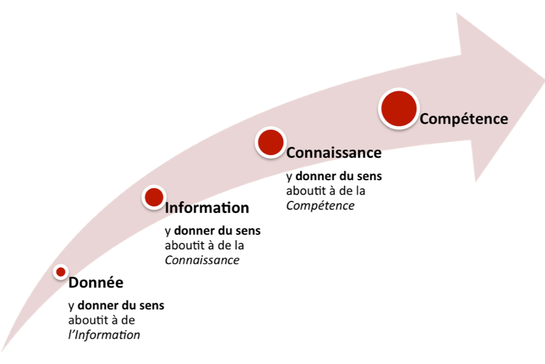
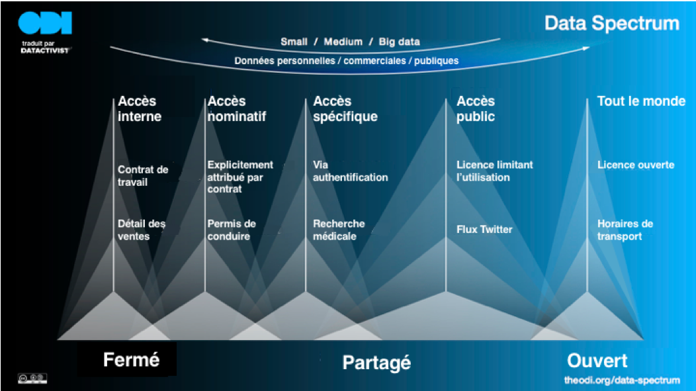
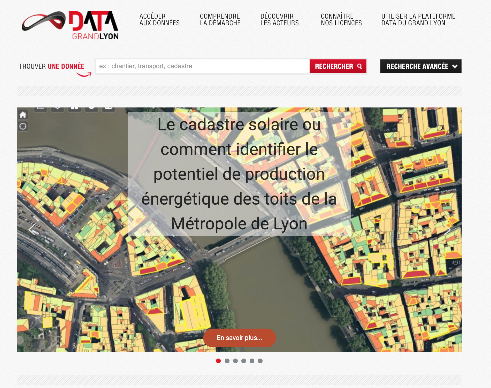
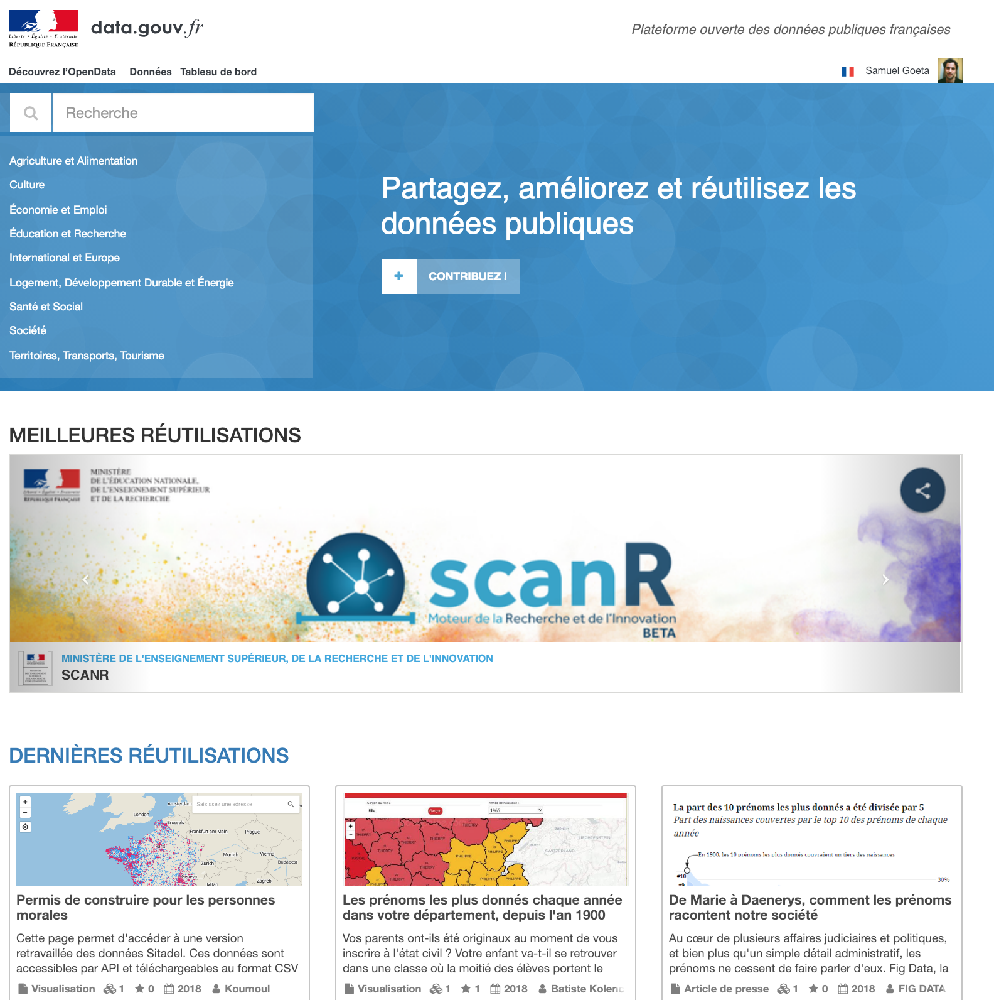
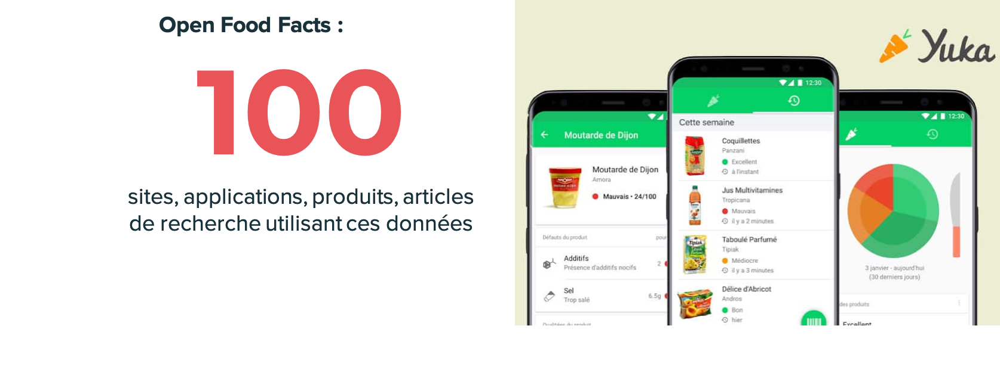

class:center, middle, inverse

#### Cette présentation en ligne : 

### [datactivist.coop/opendatacestquoi](datactivist.coop/opendatacestquoi)

Les productions de Datactivist sont librement réutilisables selon les termes de la licence [Creative Commons 4.0 BY-SA](https://creativecommons.org/licenses/by-sa/4.0/legalcode.fr).
---
## Qui sommes nous ?

.pull-left[
Une **société coopérative et participative** (SCOP) créée en novembre 2016 qui se donne pour mission d’ouvrir les données et de les rendre utiles et utilisées. 

**Activistes** car nous militons pour l’ouverture des données, nous soutenons les acteurs du changement et nous appliquons à nous mêmes les principes que nous défendons en partageant toutes nos productions sous licence libre.		

**Nos missions** : conseil, formation, médiation

**Nos clients** : institutions, collectivités locales, ONG, entreprises…
]
				
.pull-right[ 

]

---

class: middle,center

# Une information

.pull-left[

Il fait froid
]
.pull-right[

Il fait chaud
]

---
class: middle

# Des données

.pull-left[

* Le thermomètre indique – 21°C
* La nébulosité est de 1%
* L’humidité est de 25 % 
* Coordonnées : -70.302347, 49.089568

]

.pull-right[

* Le thermomètre indique 28°C 
* La nébulosité est de 6%
* L’humidité est de 67% 
* Coordonnées : -5.144064, 123.215463

]

---

## Données > information > savoir

.reduite[

]

.pull-right[.footnote[Source : revue-cossi.info]]
---

## Les données ouvertes sont librement réutilisables
.reduite[]

---
## L'open data a des fondements historiques anciens

.reduite[]

---
## 2018 : une obligation pour tous les acteurs publics
Loi pour une République numérique : les données produites par les acteurs publics et les collectivités locales de plus de 3500 habitants doivent être **diffusées gratuitement, librement réutilisables, lisibles par les machines**

---
## Quelques exemples de portails open data

.pull-left[

]

.pull-right[

]
---
### Des données librement réutilisables pour… créer de nouveaux services

Dans le domaine des transports, d'inombrables applications sont basées sur des données ouvertes. 
---
### Des données librement réutilisables pour… créer de nouveaux services

---
### Des données librement réutilisables pour… créer de nouveaux savoirs
.reduite[]
---
### Exemple de données ouvertes : la base SIRENE
.reduite[]
---
### Des données librement réutilisables pour… améliorer nos villes
.reduite[]
.footnote[Carte par Joël Gombin dans Marsactu](https://joelgombin.github.io/marsactu_accidents/chronique.html)]
---
##Exemple de données ouvertes : les accidents de la route
.reduite[.center[]]
---
### Exemple de données ouvertes : les inspections des restaurants
.reduite2[.center[]]
.footnote[[Résultats des contrôles officiels sanitaires : dispositif d'information « Alim’confiance »](https://www.data.gouv.fr/fr/datasets/resultats-des-controles-officiels-sanitaires-dispositif-dinformation-alimconfiance/)]
---
### Exemple de données ouvertes : Les inspections des restaurants
.reduite2[.center[]]
.footnote[[Source](https://dgal.opendatasoft.com/explore/embed/dataset/export_alimconfiance/map/?disjunctive.app_libelle_activite_etablissement&disjunctive.filtre&refine.synthese_eval_sanit=A%20corriger%20de%20mani%C3%A8re%20urgente&location=6,47.24195,5.00977&static=false&datasetcard=true)]
---
class:middle, center, inverse

## Une démo ?
#### Comment recevoir des alertes sur les inspections sanitaires des restaurants et établissements sanitaires sans savoir programmer ?

.footnote[Source : https://github.com/opendatasoft/ods-cookbook/blob/master/zapier/new-record-alert.md]
---
class:middle, center, inverse
## Une démo ?
#### Comment obtenir la liste de toutes les boulangeries à Lyon en moins de 3 minutes avec OpenStreetMap?
.footnote[Source : https://datactivist.coop/atelier-osm/]
---